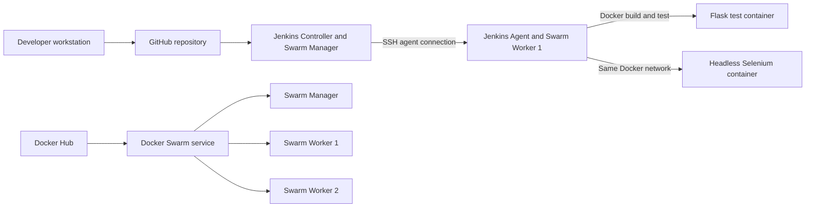

# Domain Monitoring System
## Docker Swarm and Jenkins CI Pipeline Exercise

## 1. Overview

This exercise demonstrates how a Flask monitoring application can be prepared for a distributed Docker environment and validated through an automated Jenkins pipeline.

The solution contains two related parts:

1. A three-node Docker Swarm cluster used to run the application as a replicated service.
2. A Jenkins continuous integration pipeline that builds the application, starts it in Docker, and executes containerized headless Selenium tests.

The current Jenkins pipeline is a CI pipeline. It validates an image locally on the Jenkins agent but does not automatically publish the image or update the Swarm service. Docker Hub and the Swarm cluster are prepared for a future CD stage.

## 2. Objectives

The completed exercise covers the following requirements:

- Clean the Jenkins workspace before each build.
- Clone the source code from GitHub.
- Build the Flask application image.
- Build a separate Selenium test image.
- Run the application and tests as Docker containers.
- Run Selenium in headless mode.
- Run both containers on the same Jenkins agent and Docker network.
- Store application parameters in an external JSON configuration file.
- Store the Flask secret in Jenkins Credentials instead of source control.
- Display the result of every stage through Jenkins Pipeline Stage View.
- Validate a three-node Docker Swarm deployment with three application replicas.

## 3. Architecture



### EC2 roles

| Instance | Role |
|---|---|
| EC2 instance 1 | Jenkins Controller and Docker Swarm Manager |
| EC2 instance 2 | Jenkins Agent (`docker` label) and Docker Swarm Worker 1 |
| EC2 instance 3 | Docker Swarm Worker 2 |

The Jenkins web interface is reached through an SSH tunnel to `127.0.0.1:8080`. Port 8080 does not need to be exposed publicly.

## 4. Docker Swarm Configuration

The Swarm cluster contains one manager and two workers. Cluster health is verified from the manager:

```bash
docker node ls
```

All three nodes must report `Ready` and `Active`, and the manager must report `Leader`.

The security group must allow the required Swarm traffic between members of the same security group:

| Port | Protocol | Purpose |
|---|---|---|
| 2377 | TCP | Swarm management traffic |
| 7946 | TCP/UDP | Node discovery and communication |
| 4789 | UDP | Overlay network traffic |
| 22 | TCP | Controlled SSH access between the Jenkins controller and agent |

The application image used by the Swarm exercise is:

```text
oranamar2003/domain-monitoring-system:latest
```

The service was validated with three replicas:

```bash
docker service create \
  --name domain-monitoring-service \
  --replicas 3 \
  --publish published=5000,target=5000 \
  oranamar2003/domain-monitoring-system:latest
```

Validation commands:

```bash
docker service ls
docker service ps domain-monitoring-service
```

The observed state was `3/3`, with one task running on each Swarm node. The service was later removed intentionally before configuring Jenkins:

```bash
docker service rm domain-monitoring-service
```

Removing the service does not remove the Swarm cluster or its nodes.

## 5. Jenkins Topology

Jenkins uses a controller-agent topology:

- Jenkins Controller manages the job, credentials, plugins, and build history.
- `docker-agent-1` performs all pipeline work.
- The agent has one executor and the label `docker`.
- The agent is launched through SSH as `ec2-user`.
- The remote workspace is `/home/ec2-user/jenkins-agent`.
- The node usage policy allows only jobs whose label expression matches `docker`.

Git and Docker are installed on both systems where required:

- Git on the controller retrieves the Jenkinsfile from SCM.
- Git on the agent performs the explicit pipeline checkout.
- Docker on the agent builds and runs the application and Selenium containers.

The Pipeline Stage View plugin displays the result and duration of each stage.

## 6. Jenkins Credentials

The following credentials were configured in Jenkins:

| Credential ID | Type | Purpose |
|---|---|---|
| `dms-secret-key` | Secret text | Flask `SECRET_KEY` used during CI |
| `docker-hub` | Username and password/token | Prepared for a future Docker Hub publish stage |
| `ec2-worker-1-ssh` | SSH username with private key | Connect the Jenkins controller to the agent |

Secrets are not stored in the repository. Jenkins masks the Flask secret in the console log and passes it to the application container as an environment variable.

## 7. External Application Configuration

Runtime parameters were extracted into `config.json`. The file contains four sections:

- `app`: host, port, debug mode, and session lifetime.
- `storage`: data directory, users file, and log directory.
- `monitoring`: worker count, URL limit, request timeout, time limit, and error threshold.
- `selenium`: application URL, wait values, and headless mode.

`settings.py` loads the JSON file and caches the result. A different configuration file can be supplied through the `APP_CONFIG_FILE` environment variable.

The Flask secret is intentionally excluded from `config.json`. It is supplied through the `SECRET_KEY` environment variable and Jenkins Credentials.

## 8. Containerized Selenium Testing

Selenium uses a dedicated image defined by `tests/Dockerfile.selenium`. It contains:

- Python 3.11
- Chromium
- Chromium Driver
- pytest
- Selenium
- The external JSON configuration
- The Selenium test module

The test configuration enables headless Chromium. During the pipeline, the following containers share a temporary bridge network:

```text
dms-ci-<build number>
├── dms-app-<build number>       alias: monitoring-app
└── dms-selenium-<build number>
```

The configured Selenium URL is:

```text
http://monitoring-app:5000
```

Docker's internal DNS resolves `monitoring-app` to the Flask container. No host port is required for the CI test.

## 9. Jenkins Pipeline

The Jenkins job is configured as follows:

| Setting | Value |
|---|---|
| Job name | `domain-monitoring-ci` |
| Definition | Pipeline script from SCM |
| SCM | Git |
| Repository | `https://github.com/OranAmarDevops/DevopsTMP.git` |
| Branch | `*/main` |
| Script Path | `domain-monitoring-system/Jenkins/Jenkinsfile.ci` |
| Agent label | `docker` |

### Pipeline stages

1. **Clean Workspace**  
   Deletes files left by previous builds.

2. **Git Clone**  
   Checks out the configured revision from GitHub.

3. **Docker Build**  
   Builds a Flask image and a separate Selenium image. Each image receives the Jenkins build number as its local tag.

4. **Docker Run**  
   Creates a temporary Docker network, starts the Flask container, injects the Jenkins-managed secret, and waits for the `/health` endpoint.

5. **Test**  
   Starts the headless Selenium container on the same network. The stage succeeds only when pytest exits successfully.

6. **Declarative Post Actions**  
   Prints the Flask log and removes the exact containers, network, images, and workspace created by the build.

The health check retries while Flask is starting. A connection refusal on the first attempt is acceptable when a later attempt succeeds.

## 10. Validation Results

Jenkins build number 3 produced the following results:

- Source revision: `017a85d92f72108957d41e29a709bd9b360ae063`
- Jenkins agent: `docker-agent-1`
- Total pipeline duration: approximately 2 minutes and 3 seconds
- Docker Build stage: approximately 1 minute and 2 seconds
- Test stage: approximately 35 seconds
- Selenium result: `8 passed`
- Final Jenkins result: `SUCCESS`

The successful Selenium scenarios included:

- User registration
- Empty username validation
- Short password validation
- Successful login
- Incorrect password handling
- Adding a monitored domain
- Removing all domains
- Health endpoint validation

The post-build log confirmed that both containers, the temporary network, and the two build images were removed.

## 11. Relationship Between CI and Swarm

The completed pipeline validates the application before deployment:

```text
GitHub -> Jenkins build -> Health check -> Selenium tests -> Validated image
```

Docker Swarm provides the runtime platform for the validated application:

```text
Docker Hub image -> Swarm service -> Three replicas across three nodes
```

For a complete CI/CD implementation, two additional stages can be added after `Test`:

1. **Publish**: tag the tested application image with an immutable version, authenticate with `docker-hub`, and push it to Docker Hub.
2. **Deploy**: execute `docker service update` on the Swarm manager and wait until all replicas converge successfully.

The deploy command must run on a Swarm manager. The current Jenkins agent is also a Swarm worker, so a future deploy stage must use a manager-specific agent or a controlled SSH connection to the manager.

An immutable tag such as the Jenkins build number or Git commit is preferable to deploying only `latest`, because it supports traceability and rollback.

## 12. Important Project Files

| File | Purpose |
|---|---|
| `Dockerfile` | Builds the Flask application image |
| `config.json` | Stores non-secret runtime parameters |
| `settings.py` | Loads the external configuration |
| `tests/Dockerfile.selenium` | Builds the headless Selenium image |
| `tests/requirements-selenium.txt` | Defines Selenium test dependencies |
| `tests/test_selenium.py` | Contains browser-based functional tests |
| `Jenkins/Jenkinsfile.ci` | Defines the working Jenkins CI pipeline |
| `YuriCode/` | Preserved copies of the instructor's original Jenkins examples |

## 13. Security and Operational Notes

- Do not commit passwords, access tokens, private keys, or Flask secrets.
- Keep Jenkins port 8080 private and access it through an SSH tunnel.
- Restrict SSH ingress to trusted addresses and security groups.
- Allow Swarm ports only between cluster members.
- Use Jenkins Credentials for Docker Hub and application secrets.
- Use exact names during cleanup; never remove all containers indiscriminately.
- Keep the controller workload small and execute builds on the dedicated agent.
- Monitor free disk space because Chromium images and Docker build cache are large.

## 14. Conclusion

The exercise successfully demonstrated a complete containerized CI test flow for the Domain Monitoring System. Jenkins retrieved the project from GitHub, built two Docker images, started the Flask application, ran eight headless Selenium tests on the same agent, and cleaned all temporary resources. Separately, the application image was validated as a three-replica Docker Swarm service across three EC2 nodes.

Together, these components provide the foundation for a full CI/CD workflow in which Jenkins validates and publishes an immutable image and Docker Swarm performs controlled distributed deployment.
