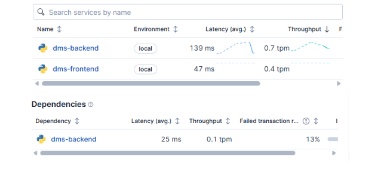
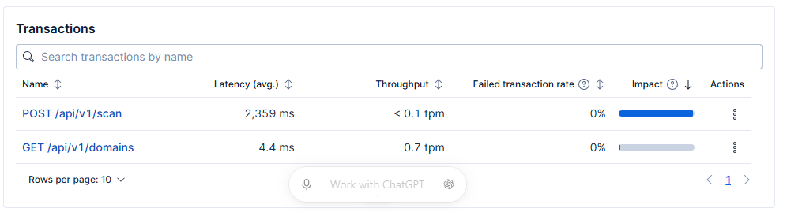
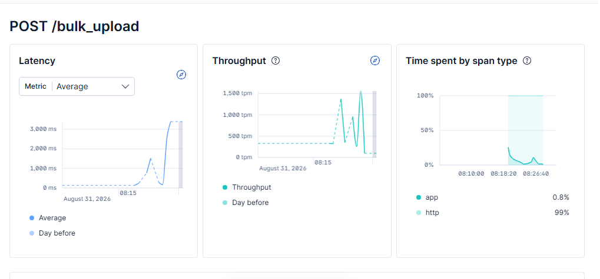
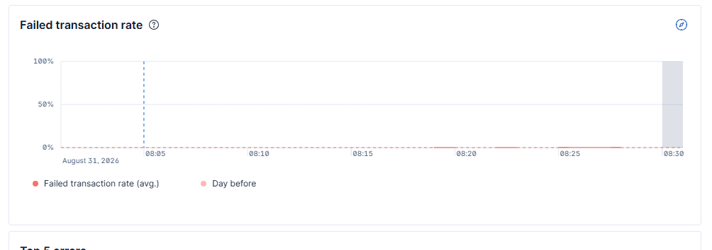
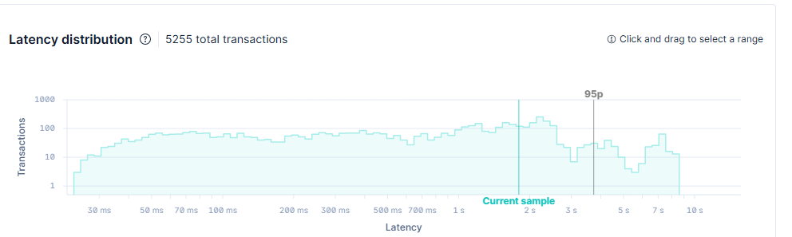
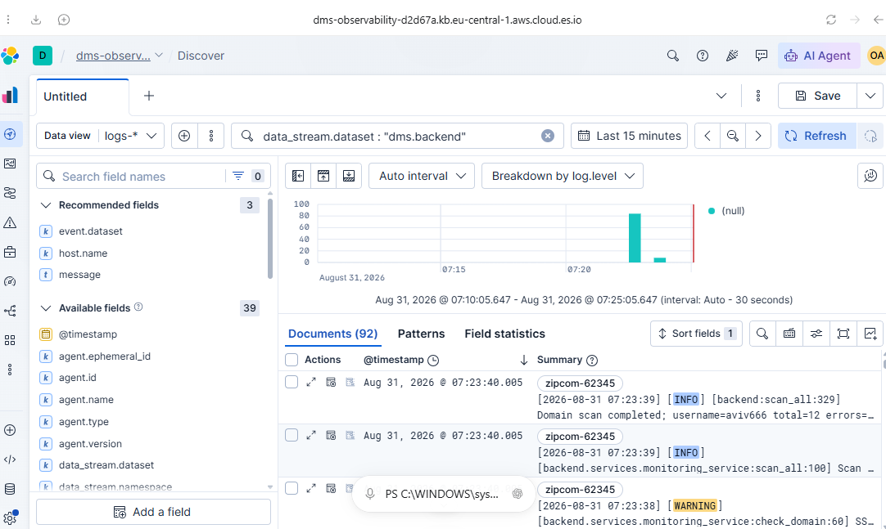
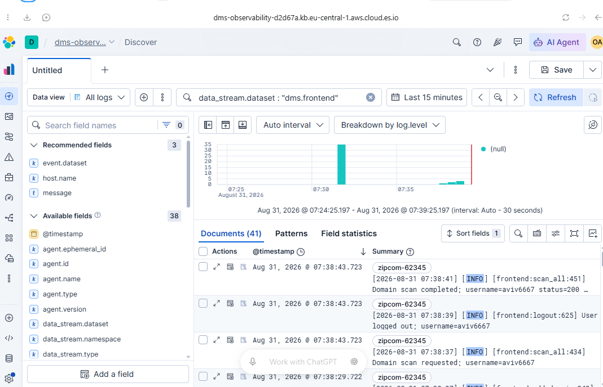
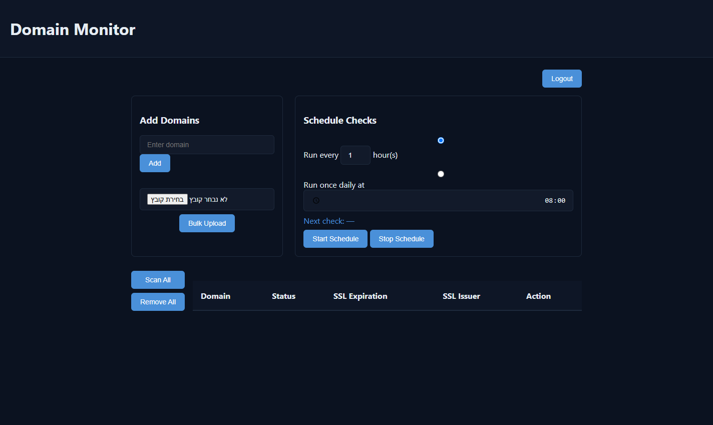

# Monitoring and Performance Test Report

## 1. Executive summary

The Domain Monitoring System was integrated with Elastic APM and Elastic
Agent, and then tested with Locust at progressively higher concurrency levels.
Both Flask services were visible in Elastic as `dms-frontend` and
`dms-backend`, their application logs were collected into separate datasets,
and the frontend-to-backend dependency was detected.

The application completed every measured Locust request without an HTTP
failure. However, latency increased sharply before errors appeared. Therefore,
the useful operating limit is lower than the largest successful test:

- **Single-domain submissions:** approximately **75 concurrent users** for a
  responsive service. At 100 users, p95 latency exceeded one second.
- **Bulk submissions (10 domains per request):** approximately **25 concurrent
  users** for a responsive service. At 50 users, p95 latency reached 1.6
  seconds.
- The highest tested levels were 200 single-domain users and 150 bulk users.
  These are maximum *tested* levels, not proven failure limits.

An additional Selenium comparison showed that 50 concurrent bulk users
increased average dashboard wall-clock load time from 330.04 ms to 531.18 ms
(60.9%), while browser navigation time increased by 133.3%.

## 2. Test environment

| Component | Configuration |
|---|---|
| Application | Flask frontend and Flask backend microservices |
| Runtime | Local Windows development environment |
| Frontend | `http://127.0.0.1:5000` |
| Backend | `http://127.0.0.1:5001` |
| APM services | `dms-frontend`, `dms-backend` |
| Log collection | Elastic Agent with Custom Logs (Filestream) |
| Log datasets | `dms.frontend`, `dms.backend` |
| Load generator | Locust 2.32.4, Python 3.11 |
| Persistence | JSON files with synchronized and atomic writes |

These results describe the local Flask development servers and file-based
storage. They should not be treated as production capacity figures.

## 3. Elastic Stack integration

### 3.1 APM instrumentation

The official Elastic Python APM agent was added to both Flask applications.
Environment variables provide the service name, APM server URL, secret token,
and environment. Secrets are not stored in source control.

Elastic detected both services and the outgoing frontend dependency on the
backend:

### 3.2 Backend observations

The backend transaction view showed:

| Transaction | Average latency | Failed transaction rate |
|---|---:|---:|
| `POST /api/v1/scan` | 2,359 ms | 0% |
| `GET /api/v1/domains` | 4.4 ms | 0% |

Domain scanning is the slowest measured backend operation. This is expected
because a scan performs external HTTP and TLS certificate checks, while
reading the domain list is a local file operation.

### 3.3 Frontend observations under bulk load

During the bulk test, Elastic recorded more than 5,000 `POST /bulk_upload`
transactions. The APM charts showed latency increasing beyond three seconds at
the heaviest load, while the failed transaction rate remained at 0%.

The span breakdown attributed approximately 99% of the observed bulk request
time to HTTP communication. This indicates that frontend-to-backend calls and
backend processing dominate the request rather than frontend rendering.

### 3.4 Centralized logs

The applications write consistent log messages to the console and dedicated
files. Elastic Agent collects those files with separate datasets, allowing
each service to be filtered in Discover.

The collected events include registration, authentication, domain changes,
bulk uploads, scans, scheduling activity, backend communication failures, and
HTTP/TLS warnings.

## 4. Locust methodology

Two tagged Locust scenarios were executed independently:

1. **Single-domain submission:** each virtual user registers, logs in, and
   repeatedly submits one unique domain.
2. **Bulk-domain submission:** each virtual user registers, logs in, and
   repeatedly uploads an in-memory text file containing ten unique domains.

The user count was increased in steps. The endpoint statistics below exclude
the one-time registration and login requests so they describe the operation
being tested.

For this report, the responsive threshold is p95 latency below one second with
a 0% failure rate. This is a test-specific threshold, not a universal SLA.

## 5. Locust results

### 5.1 Single-domain submissions

| Concurrent users | Requests | Average | Median | p95 | Maximum | Requests/s | Failures |
|---:|---:|---:|---:|---:|---:|---:|---:|
| 10 | 279 | 29 ms | 22 ms | 57 ms | 354 ms | 4.78 | 0% |
| 25 | 712 | 33 ms | 22 ms | 97 ms | 236 ms | 12.14 | 0% |
| 50 | 1,390 | 48 ms | 25 ms | 160 ms | 493 ms | 23.73 | 0% |
| 75 | 2,021 | 98 ms | 35 ms | 370 ms | 607 ms | 34.46 | 0% |
| 100 | 2,374 | 317 ms | 100 ms | 1,100 ms | 1,449 ms | 40.81 | 0% |
| 150 | 3,072 | 696 ms | 270 ms | 2,300 ms | 2,550 ms | 51.96 | 0% |
| 200 | 2,986 | 1,582 ms | 1,100 ms | 4,000 ms | 5,614 ms | 50.65 | 0% |

Performance remained strong through 75 users. Between 75 and 100 users, p95
crossed the one-second threshold. Throughput peaked near 52 requests/second at
150 users and did not improve at 200 users, while latency more than doubled.
This is clear saturation behavior.

### 5.2 Bulk submissions

Each request contains ten domains.

| Concurrent users | Requests | Average | Median | p95 | Maximum | Requests/s | Approx. domains/s | Failures |
|---:|---:|---:|---:|---:|---:|---:|---:|---:|
| 25 | 651 | 203 ms | 120 ms | 580 ms | 949 ms | 11.04 | 110.4 | 0% |
| 50 | 1,207 | 302 ms | 120 ms | 1,600 ms | 3,386 ms | 20.40 | 204.0 | 0% |
| 100 | 1,732 | 1,056 ms | 900 ms | 3,000 ms | 4,253 ms | 29.19 | 291.9 | 0% |
| 150 | 1,622 | 2,894 ms | 2,200 ms | 11,000 ms | 11,576 ms | 27.53 | 275.3 | 0% |

The bulk workload met the responsive threshold at 25 users. At 50 users, p95
rose to 1.6 seconds. Throughput peaked at approximately 292 domains/second at
100 users, then dropped at 150 users while p95 rose to 11 seconds. The 150-user
result represents saturation rather than useful capacity.

The generated HTML and CSV evidence is stored in [`tests/reports`](../tests/reports/).

## 6. Selenium UI performance under load

Selenium executed the same registration and dashboard flow in two conditions:

1. A baseline run without generated load.
2. A run while Locust generated bulk submissions from 50 concurrent users.

Both Selenium runs passed. The concurrent Locust run also completed with zero
failures: 929 bulk requests at 15.75 requests/second. Its p95 response time was
5.1 seconds, confirming that the UI measurement occurred during meaningful
backend pressure.

| UI measurement | Baseline | Under load | Change |
|---|---:|---:|---:|
| Registration to dashboard | 754.86 ms | 655.62 ms | -13.1% |
| Dashboard wall-clock average | 330.04 ms | 531.18 ms | +60.9% |
| Dashboard wall-clock median | 331.93 ms | 572.15 ms | +72.4% |
| Dashboard wall-clock p95 | 462.79 ms | 694.11 ms | +50.0% |
| Browser navigation average | 176.62 ms | 412.02 ms | +133.3% |
| Browser navigation median | 159.60 ms | 372.90 ms | +133.6% |
| Browser navigation p95 | 283.30 ms | 673.30 ms | +137.7% |

The dashboard remained functional and below one second in every Selenium
sample, but the increase in navigation and wall-clock duration is significant.
The faster registration value under load is treated as normal run-to-run
variation because it is based on one registration sample and does not match
the repeated dashboard trend.

Evidence:

- [Baseline JSON results](../tests/reports/selenium-baseline.json)
- [Under-load JSON results](../tests/reports/selenium-under-load.json)

## 7. Bottlenecks and findings

1. **External scan latency:** `POST /api/v1/scan` averaged 2.359 seconds because
   it performs network and certificate checks for multiple domains.
2. **Synchronous request processing:** long operations occupy Flask request
   workers and increase queuing under load.
3. **File-based persistence:** JSON files are suitable for this exercise but
   impose a single-host concurrency limit. Synchronized atomic writes prevent
   corruption but do not provide database-level scalability.
4. **Bulk fan-out:** one frontend request sends ten domains to the backend.
   Increased concurrency amplifies backend work and file writes.
5. **Latency precedes failure:** relying only on HTTP error rate would hide the
   performance limit. p95 latency and throughput flattening exposed saturation
   while the failure rate was still 0%.

6. **Visible UI degradation:** at 50 bulk users, dashboard navigation p95
   increased by 137.7%, even though Selenium and Locust reported no failures.

## 8. Recommended improvements

1. Run the Flask applications behind a production WSGI server such as Gunicorn
   with an appropriate worker configuration.
2. Move domain and user persistence from JSON files to a transactional database.
3. Move domain scans to a background job queue and return a job identifier to
   the client immediately.
4. Limit scan concurrency and reuse HTTP connections to protect external
   services and local resources.
5. Add timeouts, retries with backoff, and circuit-breaking behavior for
   frontend-to-backend and external HTTP calls.
6. Define service-level objectives for p95 latency and failure rate, then add
   Elastic alerts for violations.
7. Convert application log output to ECS-compatible JSON so fields such as log
   level, service name, username, and operation are directly searchable.
8. Repeat the tests in the production-like Docker/AWS environment before using
   the results for capacity planning.

## 9. Conclusion

The monitoring integration successfully correlated application behavior,
centralized logs, and controlled load-test results. No HTTP failure boundary
was reached in the selected ranges, but useful capacity limits were identified
from p95 latency and throughput saturation:

- **Recommended single-domain operating level:** up to 75 concurrent users.
- **Recommended bulk operating level:** up to 25 concurrent users.
- **Maximum tested levels:** 200 single users and 150 bulk users.

The principal improvement areas are asynchronous scan execution, production
WSGI deployment, replacing JSON persistence with a database, and protecting UI
response time when bulk work is in progress. The optional Selenium
UI-under-load measurement was completed successfully.
